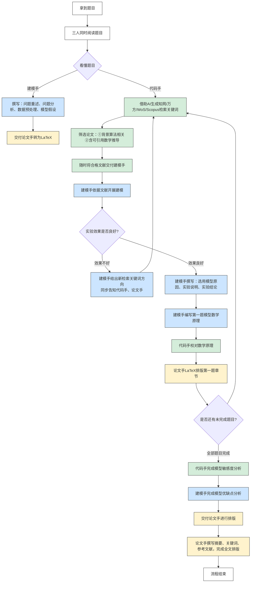

```mermaid
flowchart TD
    classDef modeller fill:#cce5ff,stroke:#333
    classDef coder fill:#d4edda,stroke:#333
    classDef writer fill:#fff3cd,stroke:#333
    classDef normal fill:#fff,stroke:#333

    A[拿到题目]:::normal --> B[三人同时阅读题目]:::normal
    B --> C{看懂题目}

    C -->|建模手| D[撰写：问题重述、问题分析、数据预处理、模型假设]:::modeller
    D --> E[交付论文手转为LaTeX]:::writer

    C -->|代码手| F[借助AI生成知网/万方/WoS/Scopus检索关键词]:::coder
    F --> G[筛选论文：①背景算法相关 ②含可引用数学推导]:::coder
    G --> H[随时将合格文献交付建模手]:::coder

    H --> I[建模手依据文献开展建模]:::modeller
    I --> J{实验效果是否良好?}
    J -->|效果不好| K[建模手给出新检索关键词方向<br>同步告知代码手、论文手]:::modeller
    K --> F
    J -->|效果良好| L[建模手撰写：选用模型原因、实验说明、实验结论]:::modeller

    L --> M[建模手编写第一题模型数学原理]:::modeller
    M --> N[代码手校对数学原理]:::coder
    N --> O[论文手LaTeX排版第一题章节]:::writer

    O --> P{是否还有未完成题目?}
    P --> F
    P -->|全部题目完成| Q[代码手完成模型敏感度分析]:::coder
    Q --> R[建模手完成模型优缺点分析]:::modeller
    R --> S[交付论文手进行排版]:::writer
    S --> T[论文手撰写摘要、关键词、参考文献，完成全文排版]:::writer
    T --> U[流程结束]:::normal
```