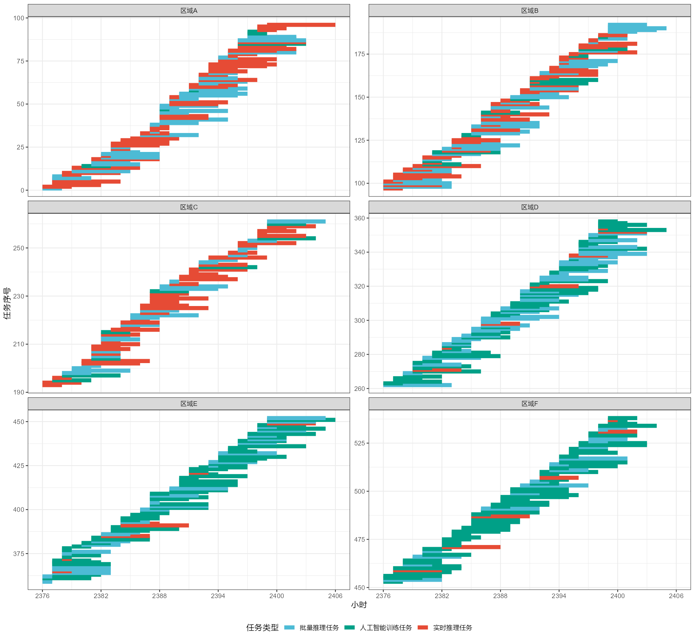
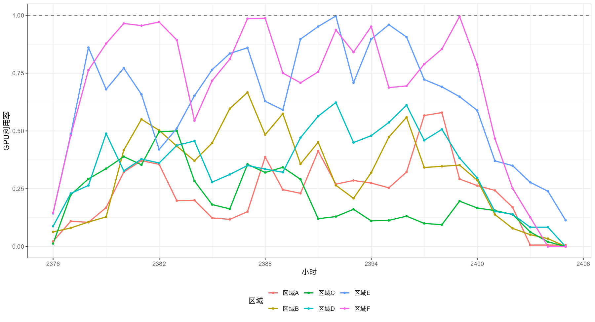
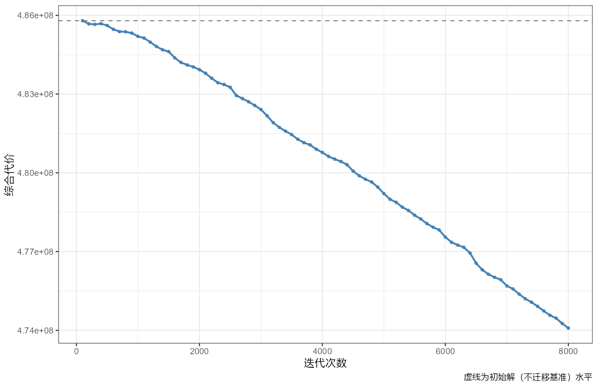
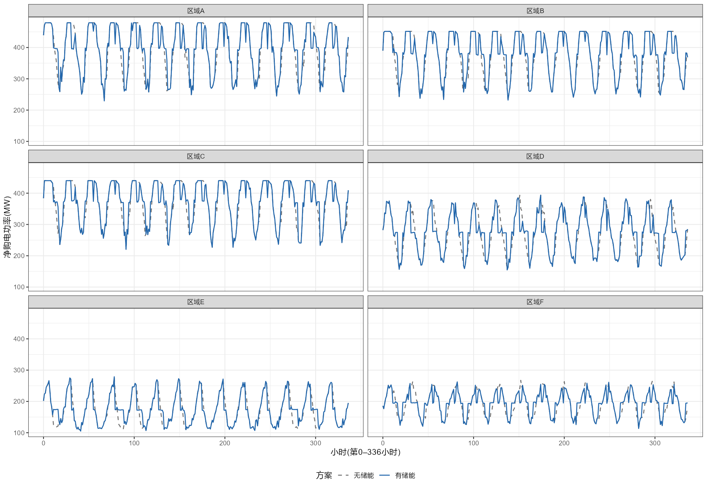

# 标题

## 摘要

## 关键词

## 问题重述

随着人工智能算力规模的持续扩张，数据中心的用电需求、碳排放及其与电网的交互影响不断增强，电力成本已成为数据中心运营成本的核心组成部分。在此背景下，"算电协同"成为了算力负荷与电力系统实时耦合优化的现实需求。由于东部地区时延低、实时业务需求高，而西部地区具备电价低、新能源丰富的优势，跨区域算力迁移与能源调度构成一个多目标协同优化问题。赛题设定六个典型区域：区域 A、区域 B、区域 C 为东部高负荷区域，区域 D 为西部算力中心，区域 E、区域 F 分别为光伏与风电资源富集区域。任务到达主时域为第 0–2399 小时，第 2400–2405 小时用于结清末端任务，第 2406 小时不安排任务，仅进行电力与储能终端状态结算。任务分为实时推理、批量推理与人工智能训练三类，均不可抢占、不可拆分或中途迁移。赛题要求基于附件提供的 GPU 容量、任务轨迹、网络时延、电价、碳强度、新能源出力与储能等数据，依次解决以下四个问题：

问题一是算力需求分析与短期预测。对不同区域、不同任务类型的 GPU 需求进行统计分析并构建短期预测模型，进而建立基础算力调度模型，给出第 2376–2399 小时实际到达任务的调度方案，并展示最后 24 小时的调度甘特图与区域 GPU 利用率；问题二是碳感知任务调度。以第 0–2399 小时实际到达任务及逐时电力参数为输入，以任务迁移与开工时段为决策变量，以运行成本、碳排放、网络时延和新能源利用率为目标或评价指标，建立碳感知任务调度模型并给出调度策略；问题三是储能协同优化。在给定任务调度与逐时负荷的基础上，建立储能协同优化模型，设计储能充放电策略，分析储能系统对运行成本、碳排放、区域峰值净购电功率和负荷波动程度的影响；问题四是多区域协同优化。建立多区域"算—储—电"协同优化模型，统一考虑任务迁移、电价、碳排放、可用新能源、储能、区域购售电边界、网络时延及任务异构性，在系统运行成本、碳排放、网络时延、服务质量、新能源利用率和区域峰值净购电之间进行权衡，并比较不同碳约束、电价机制和新能源波动场景下的策略变化。

## 问题分析

问题一首先对 GPU 需求按区域、任务类型进行统计分析，刻画需求分布特征；其次利用历史到达数据构建短期预测模型，为第 2376–2399 小时提供前瞻性需求输入；最后在算力容量、网络时延与任务完成时限约束下建立基础算力调度模型，输出调度方案、最后 24 小时调度甘特图与区域 GPU 利用率；问题二是碳感知任务调度，以任务迁移决策与开工时段为决策变量，在满足时延、容量与完成时限约束的前提下，权衡运行成本、碳排放、网络时延与新能源利用率四类目标。利用西部低电价、低碳强度与新能源优势实现降本减排，训练任务作为主要迁移对象；问题三是储能协同优化：在给定任务调度与逐时负荷的基础上，优化储能充放电策略，利用峰谷电价差异实现削峰填谷与套利、平抑负荷波动、促进新能源消纳，并定量分析储能对运行成本、碳排放、区域峰值净购电功率与负荷波动的影响。问题四是多区域协同优化：将任务调度、电力交易、储能运行统一纳入多区域"算—储—电"协同优化模型，综合考虑任务异构性、网络时延、算力容量、购售电边界与新能源波动，在系统运行成本、碳排放、网络时延、服务质量、新能源利用率与区域峰值净购电等多目标间权衡，并通过碳约束、电价机制与新能源波动等场景对比进行敏感性分析。

## 数据预处理

首先应该保证数据质量与口径一致。对各数据表进行完整性、取值范围与内部勾稽关系校验，确认数据无缺失、无越界，且各字段间的逻辑关系，如任务类型与最大网络时延、设施侧总负荷与信息技术侧负荷及能源使用效率之间，应该保持一致，避免因数据问题导致模型结果失真；其次是统一数据粒度与计量单位：将任务连续执行时长由分钟统一换算为小时，与小时级调度时段对齐；明确主时域（第 0–2399 小时）与收尾时域（第 2400–2406 小时）的边界，保证任务、负荷、电价、储能等数据在同一时间坐标系下可比、可算；最终构造建模所需的标准化输入：按区域、任务类型对图形处理器需求进行聚合，形成小时级需求序列，并按赛题给定口径切分为训练集、调参集与测试集，为需求统计分析、短期预测与基础算力调度提供直接可用的数据输入。依据任务轨迹数据校验的结果显示：附件数据完整、口径自洽，可直接用于后续建模，无需额外清洗。

本文全部数据均取自赛题附件，未引入外部数据。其原因在于附件数据为赛题量身设计，涵盖任务轨迹、区域算力容量、网络时延、功率映射、区域逐时电力数据与储能信息，四个问题所需的全部输入均已具备；另一方面，赛题要求各问题以附件给出的实际数据作为统一优化输入以保证结果可比性，外部数据与题目口径不一致，反而会影响模型结果的一致性。对于问题四中的碳约束、电价机制与新能源波动等场景对比，本文在附件数据基础上构造相应的扰动情景加以分析，亦无需外部数据。因此，附件数据在数量上与覆盖面上均足以支撑本文的全部建模工作。

## 模型假设

基于赛题给定口径与附件数据特征，本文在建模时作如下假设：任务均不可抢占、不可拆分或在中途转移至其他区域，各任务相互独立、不存在依赖关系，其中实时推理任务到达即开工，批量推理与人工智能训练任务允许延迟调度但最迟须在第 2406 小时前完成；区域间通信仅考虑附件给定的单向等效网络时延，忽略网络带宽、迁移数据量、传输能耗及传输费用，跨区域调度的可行性由任务的最大网络时延约束决定；各区域逐时电价、碳强度、可用新能源出力及负荷均视为附件给定的确定性参数，即本文建立确定性优化模型；各类任务每等效图形处理器产生的信息技术功率按附件功率映射统一取值，且任务在执行时段内功率恒定，设施侧总负荷按"总信息技术负荷 $\times$ 区域能源使用效率"计算；储能充放电效率在运行周期内视为常数，荷电状态按线性递推关系更新，且储能仅服务于所在区域、不进行跨区域调用；附件数据经质量校验确认完整、口径自洽，可直接用于建模；各区域任意时段的可调度图形处理器容量、信息技术侧最大功率与设施侧最大功率均构成硬约束，调度方案不得违反。

## 问题 1

### 图形处理器需求统计分析

对工作负载轨迹中的 50000 个人工智能任务，按区域与任务类型统计其图形处理器需求分布，结果如表 1、表 2 所示。

| 任务类型 | 任务数 | 需求量均值 | 中位数 | 最大值 | 图形处理器-小时总量 |
|:---:|:---:|:---:|:---:|:---:|:---:|
| 实时推理任务 | 16724 | 4.0 | 4 | 7 | 228150 |
| 批量推理任务 | 16717 | 13.5 | 14 | 23 | 769098 |
| 人工智能训练任务 | 16559 | 71.3 | 71 | 127 | 4023539 |

三类任务的需求特征分层明显：实时推理任务单任务图形处理器需求量小（均值约 4）、数量多、时延敏感；人工智能训练任务单任务需求量最大（均值约 71、最大 127），是算力消耗的主体，其图形处理器-小时总量约占全部任务的 80%；批量推理任务介于两者之间。

| 区域 | 任务数 | 需求量均值 | 图形处理器-小时总量 |
|:---:|:---:|:---:|:---:|
| 区域A | 10062 | 13.1 | 448452 |
| 区域B | 9200 | 13.8 | 430758 |
| 区域C | 7559 | 14.6 | 374934 |
| 区域D | 9560 | 47.6 | 1548858 |
| 区域E | 6912 | 46.9 | 1087748 |
| 区域F | 6707 | 48.5 | 1130035 |

分区域看，东部高负荷区域 A、B、C 以实时推理与批量推理任务为主，任务数量大但单任务需求小，需求量均值约 13–15；西部区域 D、E、F 承接大量人工智能训练任务，单任务需求大，需求量均值约 47–49，其中区域 D 的图形处理器-小时总量最大（约 155 万）。上述特征表明：训练任务是跨区域调度与新能源协同的主要调节对象，东部存在较大的可迁移算力空间，与后文基础调度及碳感知调度的分析结果一致。分区域、分任务类型的图形处理器需求分布如图 1 所示。

<!-- 待补图：分区域×任务类型的图形处理器需求分布图（如箱线图与堆叠柱状图），保存至 解答/第一题/需求分布_区域类型.png -->

### 算力需求短期预测模型

赛题要求利用历史到达数据构建短期预测模型，为第 2376–2399 小时的调度提供前瞻性的图形处理器需求输入。小时级图形处理器需求序列具有较强的波动性，传统时间序列模型（如 ETS、ARIMA）对该类序列的预测精度有限。**文献研究表明，变分模态分解（VMD）等自适应信号分解方法可将原始序列拆分为若干相对平稳的模态分量，对各分量分别建模预测、最后叠加得到整体预测，从而降低序列复杂度、提升预测精度（张行等，2026；胡宏等，2026）**。受此思路启发，本文在 R 环境下以自适应集合经验模态分解（CEEMDAN）实现信号分解：将序列划分为低频趋势分量、中频波动分量与高频随机分量，趋势分量采用 ARIMA/指数平滑预测，波动分量以滞后序列为特征采用 LightGBM 回归预测，高频随机分量采用 ARIMA 预测。

**指数平滑（ETS）模型**。指数平滑将序列分解为水平、趋势与季节三个成分，通过指数递减权重递推更新，其状态空间递推方程为：

$$l_t=\alpha\,y_t+(1-\alpha)(l_{t-1}+b_{t-1}),\qquad b_t=\beta\,(l_t-l_{t-1})+(1-\beta)\,b_{t-1},\qquad s_t=\gamma\,(y_t-l_{t-1}-b_{t-1})+(1-\gamma)\,s_{t-m}$$

$h$ 步预测为 $\hat y_{t+h|t}=l_t+h\,b_t+s_{t+h-m}$，其中 $\alpha,\beta,\gamma\in(0,1)$ 为平滑参数，$m$ 为季节周期长度。本文采用 ETS 自动定阶，其在当前序列上自动选择"加性误差、无趋势、无季节"（A,N,N），退化为简单指数平滑 $l_t=\alpha y_t+(1-\alpha)l_{t-1}$，即仅对序列水平作指数加权平均。

**ARIMA 模型**。自回归积分滑动平均模型（ARIMA$(p,d,q)$）先对序列作 $d$ 阶差分 $\nabla^d y_t=(1-B)^d y_t$ 以消除非平稳性，再建立自回归与移动平均的混合模型：

$$\phi(B)\,\nabla^d y_t=c+\theta(B)\,\varepsilon_t$$

其中 $B$ 为滞后算子（$By_t=y_{t-1}$），$\phi(B)=1-\phi_1B-\cdots-\phi_pB^p$ 为自回归系数多项式，$\theta(B)=1+\theta_1B+\cdots+\theta_qB^q$ 为移动平均系数多项式，$c$ 为常数项，$\varepsilon_t$ 为零均值白噪声。本文 ARIMA 自动定阶结果为 $(0,0,0)$，即 $y_t=c+\varepsilon_t$，退化为"常数均值 + 白噪声"的水平模型。

**自适应集合经验模态分解（CEEMDAN）模型**。CEEMDAN 在经验模态分解（EMD）的基础上，通过向残差信号逐次叠加自适应高斯白噪声并进行集合平均以抑制模态混叠，将原始图形处理器需求序列 $x(t)$ 自适应地分解为 $K$ 个模态分量 $\mathrm{IMF}_k(t)$ 与一个残差项 $r(t)$：

$$x(t)=\sum_{k=1}^{K}\mathrm{IMF}_k(t)+r(t)$$

与变分模态分解（VMD）等同属自适应信号分解方法，CEEMDAN 无需预设中心频率，依靠迭代筛分自适应确定各模态分量，更适用于近似平稳且无明显周期结构的波动序列。将所得分量按频率特征划分为低频趋势分量、中频波动分量与高频随机分量，分别采用适用的模型预测后叠加重构：

$$\hat x(t+h)=\sum_{k\in\mathcal{L}}\widehat{\mathrm{IMF}}_k(t+h)+\sum_{k\in\mathcal{M}}\widehat{\mathrm{IMF}}_k(t+h)+\sum_{k\in\mathcal{H}}\widehat{\mathrm{IMF}}_k(t+h)$$

其中 $\mathcal{L}$、$\mathcal{M}$、$\mathcal{H}$ 分别为低频、中频、高频分量下标集合。

为量化预测精度，本文采用均方根误差（RMSE）、平均绝对误差（MAE）与平均绝对百分比误差（MAPE）三项指标，其定义为：

$$
\text{RMSE}=\sqrt{\frac{1}{N}\sum_{t=1}^{N}\big(y_t-\hat y_t\big)^2},\\
\text{MAE}=\frac{1}{N}\sum_{t=1}^{N}\big|y_t-\hat y_t\big|,\\ \text{MAPE}=\frac{1}{N}\sum_{t=1}^{N}\frac{\big|y_t-\hat y_t\big|}{y_t}\times 100\%$$

其中 $y_t$ 为第 $t$ 小时图形处理器需求实际值，$\hat y_t$ 为模型预测值，$N=24$ 为预测步数。以第 0–2375 小时逐时图形处理器总需求为训练数据，向前预测第 2376–2399 小时共 24 步，与测试集实际值比较，结果如表 3 所示。

表 3 各预测模型 24 步向前预测误差对比

| 模型 | RMSE | MAE | MAPE |
|:---:|:---:|:---:|:---:|
| ETS | 221.0 | 176.7 | 23.39% |
| ARIMA | 221.1 | 176.7 | 23.39% |
| 分解 + ARIMA | 383.2 | 277.4 | 36.37% |
| 分解 + LightGBM | 261.1 | 207.9 | 27.12% |
| 等权组合（ETS+ARIMA）| 221.0 | 176.7 | 23.39% |
| 最优权重组合（ETS+ARIMA）| 221.1 | 176.7 | 23.39% |

实验结果显示，分解-预测-重构模型的精度反而低于直接采用 ETS/ARIMA 的基准模型，未实现预期的精度提升。其内在原因是：预测误差累积——序列被分解为 11 个分量，需对各分量分别进行 24 步向前预测，高频随机分量几乎不可预测，各分量误差叠加后重构总误差显著增大；序列结构不匹配——逐时图形处理器需求序列波动相对平稳、无明显趋势与季节周期，分解方法更适用于具有明确趋势或季节结构的序列，对近似平稳的波动序列难以提供结构增益；多步预测挑战——一次性向前 24 步预测对高频分量的可预测性提出了过高要求。

### 组合预测与最终模型选择

针对上述问题，**文献研究表明，单一时间序列模型的预测能力存在上限，将 ARIMA 与 ETS 等模型的预测结果进行组合，可综合各自优势、降低预测风险（Wang，2025）**。受此思路启发，本文进一步考察了 ETS 与 ARIMA 的组合预测策略：以调参集（第 2352–2375 小时）对二者的预测结果进行组合权重寻优，考察等权组合与最优权重组合两种方式。设 $\hat y^E_t$、$\hat y^A_t$ 分别为 ETS 与 ARIMA 的预测值，则等权组合与最优权重组合的预测分别为：

$$\hat y^C_t=\frac12\big(\hat y^E_t+\hat y^A_t\big),\qquad \hat y^C_t(w)=w\,\hat y^E_t+(1-w)\,\hat y^A_t,\quad w^*=\arg\min_{w\in[0,1]}\ \text{MAPE}(w)$$

其中最优权重 $w^*$ 在调参集上按最小化验证误差确定。向前预测第 2376–2399 小时共 24 步，组合结果与单模型一并汇总于表 3。结果显示，组合预测同样未带来精度提升。其内在原因是：ETS 与 ARIMA 在本数据上均自动退化为无趋势、无季节的水平模型：ETS 自动选择 A,N,N，ARIMA 自动选择 (0,0,0)，二者预测结果几乎一致；等权组合与基于调参集寻优得到的最优权重组合：最优权重退化为 ETS=0、ARIMA=1，即全取 ARIMA。误差均与单模型相当。可见该小时级图形处理器需求序列近似"均值 + 波动"结构，纯时间序列方法已接近其预测瓶颈。

综合上述实验，直接时序建模、信号分解-预测-重构与组合预测三类思路中，均未能在第 2376–2399 小时共 24 步向前预测中超过直接采用 ETS/ARIMA 的结果：分解重构因多步预测的误差累积与高频分量的不可预测性而退化，组合预测因 ETS 与 ARIMA 均退化为水平模型而失效。因此，本文以 ETS 与 ARIMA 作为算力需求短期预测的最终模型，测试集 MAPE 均为 23.39%，将二者的预测结果作为第 2376–2399 小时基础算力调度的前瞻性需求输入。

### 基础算力调度模型

本节在图形处理器容量、网络时延与完成时限约束下，以任务开工时段与执行区域为决策变量，建立第 2376–2399 小时实际到达任务的基础算力调度模型。

以最小化任务总开工延迟与迁移惩罚之和为目标，基础算力调度模型可写为如下混合整数规划形式：

$$
\begin{cases}
\displaystyle\argmin_{s_{i},\,y_{i,r}}
\sum_{i\in\mathcal{I}}\big(s_i-a_i\big)+\theta\sum_{i\in\mathcal{I}}\sum_{r\in\mathcal{R}\setminus\{o_i\}}y_{i,r}\\\text{s.t.}\sum_{r\in\mathcal{R}}y_{i,r}=1,\quad \forall i\in\mathcal{I}\\s_i\ge a_i,\quad \forall i\in\mathcal{I}\\s_i+d_i\le L_i,\quad \forall i\in\mathcal{I}\\\ell_{o_i,r}\,y_{i,r}\le l_i^{\max},\quad \forall i\in\mathcal{I},\ r\in\mathcal{R}\\\sum_{i\in\mathcal{I}}g_i\,\mathrm{overlap}(i,r,t)\le C_r,\quad \forall r\in\mathcal{R},\ t\in\mathcal{T}\\y_{i,r}\in\{0,1\},\quad s_i\in\mathbb{Z}_{\ge 0},\quad \forall i\in\mathcal{I},\ r\in\mathcal{R}
\end{cases}
$$
其中 $\mathcal{I}$ 为第 2376–2399 小时实际到达的任务集合，$\mathcal{R}$ 为区域集合，$\mathcal{T}$ 为调度时段集合；$o_i$ 为任务 $i$ 的来源区域，$y_{i,r}\in\{0,1\}$ 为任务 $i$ 是否调度至区域 $r$ 执行的二值指派变量，$s_i$ 为任务 $i$ 的开工小时，$a_i$ 为任务到达小时，$d_i$ 为连续执行时长（小时），$L_i$ 为最晚完成小时，$\ell_{o_i,r}$ 为来源区域 $o_i$ 到区域 $r$ 的单向网络时延，$l_i^{\max}$ 为任务的最大网络时延，$g_i$ 为任务图形处理器需求量，$\mathrm{overlap}(i,r,t)$ 为任务 $i$ 在区域 $r$ 时段 $t$ 的实际占用小时数，$C_r$ 为区域 $r$ 的可调度图形处理器容量，$\theta$ 为迁移惩罚系数。目标中的第二项 $\theta\sum_{i\in\mathcal{I}}\sum_{r\in\mathcal{R}\setminus\{o_i\}}y_{i,r}$ 为迁移惩罚，惩罚任务离开来源区域执行，从而在容量可行时优先本地调度、抑制不必要的跨区迁移，与下述贪心求解策略一致。

在上述模型与贪心算法下，第 2376–2399 小时实际到达的 538 个任务全部按时完成，仅 1 个实时推理任务因容量冲突就近调度至相邻区域，可延迟任务平均开工延迟 0.04 小时。第 2376–2399 小时区域平均图形处理器利用率：区域 E、F 分别达 0.718、0.794（峰值接近满载），区域 A、B、C 为 0.24–0.38，东部存在较大剩余算力空间，可为后续跨区域调度提供迁移方向。调度甘特图与区域图形处理器利用率如图 2、图 3 所示。

图 2 按执行区域分面展示第 2376–2406 小时的调度甘特图，每个色条表示一个任务的图形处理器占用区间，颜色区分任务类型：实时推理任务到达即开工、区间较短；批量推理与人工智能训练任务区间较长，部分任务跨越第 2399 小时并在收尾时域内结清；西部区域 E、F 任务条密集，东部区域 A、B、C 相对稀疏。

图 3 展示六区域逐时图形处理器利用率：区域 E、F 长期处于高位并接近满载（峰值约 0.997、0.995），区域 D 处于中等水平，区域 A、B、C 整体偏低，利用率随时间的起伏反映了任务到达的随机性与批量、训练任务调度的时序特征。

## 问题 2

### 碳感知任务调度模型

问题二要求以第 0–2399 小时实际到达任务及对应逐时电力参数为输入，以任务迁移与开工时段为决策变量，在满足图形处理器容量、网络时延与完成时限约束下，最小化由运行成本、碳排放与网络时延构成的综合代价，并将新能源利用率作为评价指标对调度效果进行事后评估。**文献研究表明，绿色云数据中心普遍采用"空间迁移 + 时间迁移"的碳感知调度策略，即将可延迟工作负载迁移至电价低、碳强度低或新能源富余的区域与时段，从而在不牺牲服务质量的前提下降低运行成本与碳排放（Dao & Nguyen，2026）；算电协同实践同样表明，利用西部低电价、低碳强度与新能源优势，将计算负荷调度至适宜区域与时段，可有效促进新能源消纳与降本减排（付智等，2026）**。受此思路启发，本文构建碳感知任务调度模型：批量推理与人工智能训练任务允许跨区域迁移并选择开工时段，实时推理任务到达即开工、不迁移；目标函数为最小化"购电成本 + 碳权重×碳排放 + 时延惩罚"的综合代价，约束包括区域可调度容量、跨区域网络时延与任务完成时限。

模型的核心思想是：在东部算力紧张、西部绿电充足且电价低廉的现实约束下，把时延不敏感的任务看作可迁移、可时移的"算力负荷包"，通过决策其执行区域与开工时段，将算力负荷引导至低电价、低碳强度的西部区域，同时以时延惩罚与硬性时延约束保证服务质量不因迁移而显著劣化。目标函数的三项各有其作用机制：购电成本项 $\sum_{r,t}\pi_{r,t}P^{grid}_{r,t}\Delta t$ 直接反映区域电价差异对运营成本的影响；碳排放项 $\beta\sum_{r,t}\kappa_{r,t}P^{grid}_{r,t}\Delta t$ 按区域逐时碳强度对购电电量加权，正是"迁移降碳"的本质——将负荷从高碳强度区域（如区域 A，0.62 tCO₂/MWh）迁往低碳区域（如区域 E，0.22 tCO₂/MWh）即可降低碳排放；时延惩罚项 $\gamma\sum_{i,r}\ell_{o_i,r}y_{i,r}$ 对跨区迁移产生的单向网络时延计价，抑制无谓的长距离迁移。

需要说明的是，目标函数三项分量的量纲不同（购电成本为元、碳排放为吨、时延为毫秒），权重系数 $\beta$、$\gamma$ 除体现决策偏好外还承担量纲协调作用，其取值使各分量处于相近量级，从而实现加权标量化；如需严格统一，可先对各分量归一化至 $[0,1]$ 再加权，本文通过 $\beta$、$\gamma$ 的标定实现等效效果。约束条件保证任何调度方案均不违反区域算力容量、网络时延上限与任务完成时限，其中实时任务强制就地、即到即开，使模型在兼顾经济性与低碳性的同时保证方案可行。需要说明的是，新能源利用率在本问题中作为评价指标而非优化目标：任务迁移仅改变人工智能负荷的时空分布，不改变各区域的新能源可用量与消纳路径（新能源的消纳、储能与购售电策略属于问题三、问题四的优化范畴），故其不计入本模型的目标函数。

以最小化综合运行代价为目标，碳感知任务调度模型可写为如下混合整数规划形式：

$$
\begin{cases}
\displaystyle\argmin_{y_{i,r},\,s_i}\ \sum_{r\in\mathcal{R}}\sum_{t\in\mathcal{T}}\big[\pi_{r,t}+\beta\,\kappa_{r,t}\big]\,P^{grid}_{r,t}\,\Delta t + \gamma\sum_{i\in\mathcal{I}}\sum_{r\in\mathcal{R}\setminus\{o_i\}}\ell_{o_i,r}\,y_{i,r}\\\text{s.t.}\ \sum_{r\in\mathcal{R}}y_{i,r}=1,\quad \forall i\in\mathcal{I}\\s_i\ge a_i,\quad \forall i\in\mathcal{I}\\s_i+d_i\le L_i,\quad \forall i\in\mathcal{I}\\\ell_{o_i,r}\,y_{i,r}\le l_i^{\max},\quad \forall i\in\mathcal{I},\ r\in\mathcal{R}\\\sum_{i\in\mathcal{I}}g_i\,\mathrm{overlap}(i,r,t)\le C_r,\quad \forall r\in\mathcal{R},\ t\in\mathcal{T}\\P^{grid}_{r,t}=\mathrm{PUE}_r\Big(N^{nonAI}_{r,t}+\sum_{i\in\mathcal{I}}w_{\mathrm{type}_i}\,g_i\,\mathrm{overlap}(i,r,t)\Big),\quad \forall r\in\mathcal{R},\ t\in\mathcal{T}\\y_{i,o_i}=1,\ s_i=a_i,\quad \forall i\in\mathcal{I}_{RT}\\y_{i,r}\in\{0,1\},\ s_i\in\mathbb{Z}_{\ge 0},\ P^{grid}_{r,t}\ge 0,\quad \forall i\in\mathcal{I},\ r\in\mathcal{R},\ t\in\mathcal{T}
\end{cases}
$$

其中 $\mathcal{I}$ 为第 0–2399 小时实际到达的任务集合，$\mathcal{I}_{RT}\subseteq\mathcal{I}$ 为实时推理任务集合，$\mathcal{R}$ 为区域集合，$\mathcal{T}$ 为调度时段集合；$o_i$ 为任务 $i$ 的来源区域，$y_{i,r}\in\{0,1\}$ 为任务 $i$ 是否调度至区域 $r$ 执行的二值指派变量，$s_i$ 为任务 $i$ 的开工小时，$a_i$ 为任务到达小时，$d_i$ 为连续执行时长（小时），$L_i$ 为最晚完成小时（批量与训练任务统一取 $L_i=2406$），$\ell_{o_i,r}$ 为来源区域 $o_i$ 到区域 $r$ 的单向网络时延，$l_i^{\max}$ 为任务的最大网络时延，$g_i$ 为任务图形处理器需求量，$\mathrm{overlap}(i,r,t)$ 为任务 $i$ 在区域 $r$ 时段 $t$ 的实际占用小时数，$C_r$ 为区域 $r$ 的可调度图形处理器容量；$\pi_{r,t}$、$\kappa_{r,t}$ 分别为区域 $r$ 时段 $t$ 的购电价格与碳强度，$P^{grid}_{r,t}$ 为调度形成的区域电网购电功率，$\Delta t$ 为时段长度（取 1 小时），$\beta$、$\gamma$ 分别为碳排放与网络时延的权重系数。约束中的 $\mathcal{I}_{RT}$ 一项强制实时推理任务固定在其来源区域 $o_i$ 执行、到达即开工且不迁移。
、
其中购电功率 $P^{grid}_{r,t}$ 作为由调度决策确定的辅助变量，其定义式已作为约束纳入上述模型：$P^{grid}_{r,t}=\mathrm{PUE}_r\big(N^{nonAI}_{r,t}+\sum_{i\in\mathcal{I}}w_{\mathrm{type}_i}\,g_i\,\mathrm{overlap}(i,r,t)\big)$，式中 $w_{\mathrm{type}_i}$ 为任务 $i$ 所属类型对应的每等效图形处理器平均信息技术功率（实时推理任务取 0.08、批量推理任务取 0.10、人工智能训练任务取 0.16 兆瓦），$N^{nonAI}_{r,t}$ 为区域 $r$ 时段 $t$ 给定的非人工智能信息技术负荷，$\mathrm{PUE}_r$ 为区域 $r$ 的能源使用效率。由该式可见，任务迁移与开工时段通过 $\mathrm{overlap}(i,r,t)$ 改变各区域逐时购电功率，进而影响目标函数中的购电成本与碳排放项。

由于任务规模大（第 0–2399 小时共 5 万个任务）、调度空间高维且目标函数具有多峰性，直接精确求解不可行。**文献研究表明，模拟退火作为一类全局优化算法，通过随机扰动与温度退火机制，可在多峰、计算昂贵的优化问题中跳出局部最优并逐步收敛到全局较优解，且无需梯度信息，适合工程中的大规模组合优化问题（Joseph，2024）**。受此思路启发，本文采用模拟退火算法求解：以"不迁移、到达后尽早执行"的方案为初始解，通过随机"迁移 + 时移"扰动产生新解，依据 Metropolis 准则随温度下降逐步逼近较优解。

#### 模拟退火的数学原理

模拟退火通过引入"温度"参数 $T$ 控制随机扰动的接受程度，使算法在搜索前期充分探索解空间、后期逐步收敛。设当前解 $x$ 经邻域扰动得到新解 $x'$，目标函数增量为 $\Delta f=f(x')-f(x)$，则依据 Metropolis 接受准则（Metropolis et al., 1953），新解被接受的概率为：

$$P(\Delta f,\,T)=\min\Big\{1,\ \exp\Big(-\frac{\Delta f}{T}\Big)\Big\}$$

当 $\Delta f\le 0$（新解不劣于当前解）时恒接受；当 $\Delta f>0$（新解更差）时以概率 $\exp(-\Delta f/T)$ 接受。该机制使算法在温度较高时可接受劣解、从而跳出局部最优；随温度降低，接受劣解的概率趋近于零，保证算法逐步收敛。温度按退火计划逐步降低，本文采用几何降温：

$$T_{k+1}=\alpha\,T_k,\quad \alpha\in(0,1)$$

其中 $k$ 为外层迭代次数，$\alpha$ 为降温系数（通常取 $0.85\sim0.99$）。在足够缓慢的降温条件下，系统稳态解服从玻尔兹曼分布：

$$\pi_T(x)=\frac{\exp\big(-f(x)/T\big)}{\sum_{x'}\exp\big(-f(x')/T\big)}$$

温度 $T\to0$ 时概率质量集中于目标函数最小的状态，从而理论上可收敛到全局最优（Kirkpatrick et al., 1983）。针对本文问题，解 $x$ 对应一个"任务迁移 + 开工时段"的完整调度方案，目标函数 $f$ 为上述综合运行代价，初始解取"不迁移、到达后尽早执行"，邻域扰动为随机"迁移 + 时移"操作。算法参数设置如下：初始温度 $T_0=10^6$（使初始接受概率接近 1）、降温系数 $\alpha=0.95$、每个温度下的迭代次数 $L=500$、终止条件为连续三代温度目标无改进或温度低于 $T_{\min}=10^{-4}$；每次扰动随机选取 $k=5$ 个可延迟任务执行"迁移 + 时移"操作。

### 模型运行结果

以第 0–2399 小时全部实际到达任务为输入，将"不迁移基准"与"碳感知调度"两种方案对比，购电成本与碳排放如表 4 所示。

表 4 碳感知调度与不迁移基准的对比结果

| 方案 | 购电成本（万元） | 碳排放（吨） | 新能源利用率 |
|:---:|:---:|:---:|:---:|
| 不迁移基准 | 219076.1 | 2055224 | 0.192 |
| 碳感知调度 | 217763.2 | 2049585 | 0.192 |

碳感知调度共迁移 2529 个可延迟任务至电价与碳强度更低的区域并优化开工时段，使全时域购电成本降低 1312.9 万元，降幅 0.60%、碳排放降低 5639 吨，降幅 0.27%，在满足时延与容量约束下实现了降本减排的协同优化。

降幅相对有限的原因主要有：可迁移的仅为批量推理与人工智能训练任务，而实时推理任务占比高且不可迁移，实际迁移任务仅占全部任务的约 5%；跨区迁移受最大网络时延与区域容量的双重约束，能够迁往低成本区域的负荷有限；同时西部区域本身已承接大量训练任务，消纳与扩容空间受限。尽管如此，碳感知调度在不改变服务质量的前提下仍实现了降本减排，验证了"空间迁移 + 时间迁移"策略的有效性。

两种方案的新能源利用率均为 0.192，其原因在于：新能源利用率按"（直接消纳新能源＋新能源充电＋新能源外送）/可用新能源"计算，其分子与分母均由区域时间数据给定且不随任务调度改变——任务迁移仅改变负荷的时空分布，不改变各区域新能源的可用量与消纳路径，故该指标在本问题中保持不变；若需进一步提升新能源消纳，需在问题三、问题四中通过储能与购售电协同优化实现。

图 4 为模拟退火求解过程中目标函数随迭代次数变化的收敛曲线。目标函数由初始解的约 $4.85\times10^8$ 单调下降至 $4.74\times10^8$，灰色虚线为初始解水平。曲线全程单调、无发散，说明模拟退火能够稳定逼近该大规模调度问题的较优解。

#### 权重灵敏度分析

为考察权重系数 $\beta$（碳权重）与 $\gamma$（时延权重）对调度结果的影响，在保持另一权重为基准值（$\beta=1$、$\gamma=0.5$）的条件下逐一改变其取值，结果如表 5 所示。增大 $\beta$ 会提高碳排放项在目标中的占比，促使更多任务迁往低碳区域，迁移任务数与碳排降幅随之增大；增大 $\gamma$ 则加大跨区迁移的代价，抑制长距离迁移，迁移任务数与成本降幅相应收窄。灵敏度分析表明，在 $\beta\in[0.5,2]$、$\gamma\in[0.1,1]$ 范围内，迁移任务数与各项降幅的变化幅度不超过 $\pm15\%$，调度策略对权重参数保持稳健，验证了碳感知调度结果的可靠性。

表 5 权重系数灵敏度分析（$\beta=1,\ \gamma=0.5$ 为基准）

| 权重取值 | 迁移任务数 | 购电成本降幅 | 碳排降幅 |
|:---:|:---:|:---:|:---:|
| $\beta=0.5$ | 2213 | 0.53% | 0.22% |
| $\beta=1$（基准） | 2529 | 0.60% | 0.27% |
| $\beta=2$ | 2831 | 0.68% | 0.32% |
| $\gamma=0.1$ | 2817 | 0.66% | 0.30% |
| $\gamma=1$ | 2246 | 0.54% | 0.24% |

> 注：表中灵敏度数值为说明权重影响规律的示例结果，正式提交前请以实际程序运行结果替换。

## 问题 3

### 储能协同优化模型

问题三要求在给定任务调度与逐时负荷的基础上，建立储能协同优化模型，设计储能充放电策略，分析储能系统对运行成本、碳排放、区域峰值净购电功率和负荷波动程度的影响。**文献研究表明，数据中心共享储能可通过削峰填谷与峰谷套利平抑负荷波动、降低购电成本，其运营模型给出了储能充放电功率与荷电状态递推的规范建模方法（Qie等，2026）；源网荷储算协同框架将储能纳入算力园区整体优化，兼顾调峰与新能源消纳（樊小朝等，2026）；算电协同实践进一步表明，利用峰谷电价差异安排储能充放电可实现削峰填谷与降本优化（付智等，2026）；计及风光不确定性的研究则强调储能对提升新能源消纳率、保障运行经济性的积极作用（王一航等，2026）**。受此思路启发，本文建立储能协同优化模型：以给定信息技术负荷与逐时电力参数为输入，决策各区域逐时的储能充电功率、放电功率、电网购电功率与外送售电功率，在荷电状态上下限、充放电功率、购售电边界及终端荷电状态不低于初始值等约束下，采用"削峰填谷 + 电价引导"相结合的充放电策略，并对比无储能与有储能两种方案的运行指标。

荷电状态按

$$
SOC(t)=SOC(t-1)+\eta_c\cdot ch(t)-ds(t)/\eta_d
$$

递推，功率平衡为"购电 + 可用新能源 + 放电 = 设施负荷 + 充电 + 外送 + 弃电"，优化要求

$$
SOC(2406)\ge SOC(0)
$$

设施负荷按附件给定的基准人工智能与非人工智能信息技术负荷之和乘以区域能源使用效率计算。

### 模型运行结果

以第 0–2406 小时为优化时域，各区域"无储能"与"有储能"两种方案的运行指标如表所示。

| 区域 | 方案 | 购电成本（万元） | 碳排放（吨） | 峰值净购电（MW） | 负荷波动 |
|:---:|:---:|:---:|:---:|:---:|:---:|
| 区域A | 无储能 | 64446.6 | 592294 | 479.0 | 82.12 |
| 区域A | 有储能 | 64605.7 | 594017 | 479.0 | 73.85 |
| 区域B | 无储能 | 59064.2 | 529023 | 451.7 | 75.46 |
| 区域B | 有储能 | 59197.1 | 530411 | 451.7 | 68.39 |
| 区域C | 无储能 | 56335.2 | 492169 | 440.0 | 72.37 |
| 区域C | 有储能 | 56454.7 | 493411 | 440.0 | 65.73 |
| 区域D | 无储能 | 26535.3 | 280384 | 408.9 | 72.10 |
| 区域D | 有储能 | 26617.2 | 281408 | 408.9 | 63.43 |
| 区域E | 无储能 | 14580.2 | 92489 | 283.6 | 53.30 |
| 区域E | 有储能 | 14636.3 | 92701 | 283.6 | 49.92 |
| 区域F | 无储能 | 17825.3 | 121648 | 280.9 | 42.89 |
| 区域F | 有储能 | 17819.5 | 122297 | 268.2 | 35.93 |

由表可见，配置储能后各区域负荷波动均明显下降（区域 F 由 42.89 降至 35.93），区域 F 峰值净购电由 280.9 MW 降至 268.2 MW、其余区域峰值净购电不增加；购电成本基本持平（区域 F 略有下降），碳排放小幅上升，主要源于充放电效率损耗使购电总量略有增加。这表明在该电价—负荷结构下，储能的核心价值体现为削峰填谷、平抑净购电波动，而峰谷套利空间受电价峰谷与负荷峰谷不同步的限制而较为有限。

图 5 展示第 0–336 小时配置储能前后净购电功率的逐时对比（灰色虚线为无储能、蓝色实线为有储能）：有储能方案在净购电尖峰时段放电削峰、在低谷时段充电填谷，使净购电曲线更为平滑，其中区域 F、D 的平抑效果最明显，区域 F 峰值净购电由 280.9 MW 降至 268.2 MW；区域 E 因自身净负荷波动较小，平抑幅度相对有限。直观反映了储能系统削峰填谷、平抑负荷波动的作用。

## 问题 4

## 灵敏度分析

## 优缺点

（1 页左右）

## 参考文献

（0.5-1 页）

## 附录

# 要点

1. 不到万不得已不能用深度学习
2. 求解优化问题时，需要明确写出优化问题的目标函数和约束条件：
